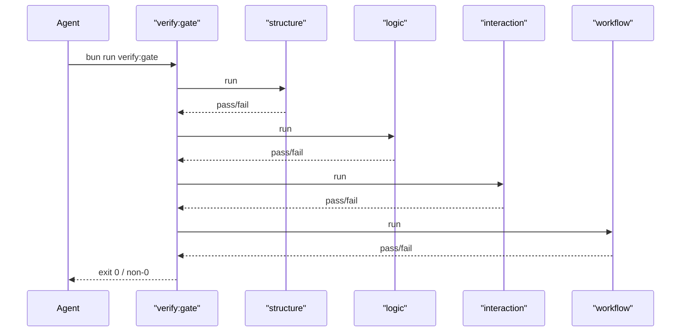

# Agent Self-Verification Hard Gate 设计

## 背景

仓库已经进入以 agent 驱动的大型结构性改造阶段。仅靠“写计划 + 跑部分测试 + 人工判断”不足以支撑 agent 自主迭代推进，因为 agent 很容易在以下几类问题上偏航：

- 代码组织越层，破坏 DDD / hexagonal 边界
- 逻辑回归没有被对应测试捕获
- 交互契约漂移，但局部测试仍然通过
- 工作流状态机或任务系统失配，导致“看似推进、实际失真”

因此，需要一套仓库级、可复用、提交前必须全量通过的硬门禁。

## 目标

- 为本仓库建立一套 agent 可独立执行的硬门禁机制。
- 该机制应覆盖：
  - 代码组织正确性
  - 逻辑正确性
  - 交互正确性
  - 工作流程正确性
- 所有小步提交前必须执行全量 gate，而不是只跑局部检查。
- 成功时不输出冗长汇总；失败时必须输出机器和人都能消费的失败分类与证据。
- 该机制必须是仓库级可复用能力，而不是只服务于一次 daemon 重构。

## 约束

- 检查本体优先复用熟悉工具：
  - `bun test`
  - `bun run typecheck`
  - `bun run lint`
  - `bun scripts/task-cli.ts doctor`
- 不把真实外部依赖纳入提交前硬门禁：
  - 不直接访问真实 Feishu
  - 不要求真实 runtime 线程
  - 不污染外部真实数据
- 外部依赖必须抽象为可替换端口，并在门禁中用本地替身覆盖。
- gate 失败时只输出失败分类与证据，不内置修复建议模板。

## 非目标

- 不构建复杂的新验证平台或 DSL。
- 不追求全量成功结果持久化归档。
- 不把真实端到端联调放进提交前门禁。

## 核心原则

### 1. 熟悉工具优先

验证系统的核心不是“发明新工具”，而是把新约束尽量表达为现有工具可执行的检查：

- 结构规则优先落成测试或静态扫描
- 逻辑规则优先落成单测、应用层测试、回归测试
- 交互规则优先落成 contract / snapshot / compatibility 测试
- 工作流规则优先落成状态机流转测试和任务系统 doctor 检查

### 2. 硬门禁

每次小步提交前必须执行同一个全量入口。任一子项失败：

- 总 gate 退出非零
- 提交被阻断
- agent 不应宣称本轮修改完成

### 3. 本地可重复

提交前 gate 必须是本地、可重复、可复现、无外部副作用的。

### 4. 失败优先

成功时只需要零退出码和简明提示；失败时必须给出：

- 失败分类
- 失败命令
- 失败证据
- 受影响对象
- 阻断级别

## 分层设计

### 入口层

统一入口：`bun run verify:gate`

职责：

- 顺序执行全量门禁
- 聚合退出码
- 在失败时输出分类和证据

### 检查层

由熟悉命令和补充检查组成：

- `typecheck`
- `lint`
- `test`
- 结构规则测试
- 交互契约测试
- 工作流测试
- 任务系统 doctor

### 规则层

分为四大类：

- `structure`
- `logic`
- `interaction`
- `workflow`

### 失败证据层

失败时输出轻量结构化结果和控制台摘要；成功时不保留大型报告。

## 四类 Gate

### 1. Structure Gate

目标：保证代码组织正确性。

主要通过“架构规则测试”完成，而不是靠文档约定。

检查内容：

- `domain` 禁止直接依赖：
  - `fetch`
  - `ws`
  - `bun:sqlite`
  - Feishu SDK
  - Node HTTP server
- `application` 只能依赖 domain port，不直接依赖具体基础设施实现
- `adapters` 不直接承载核心业务规则
- `protocol DTO` 不直接充当领域模型
- 约定目录中不允许出现跨上下文越层 import

可执行形式：

- import 规则测试
- 路径依赖扫描测试
- 目录约束测试

### 2. Logic Gate

目标：保证领域逻辑和应用编排正确性。

检查内容：

- 领域聚合和值对象测试
- 应用命令 / 查询测试
- 回归测试
- 已知缺陷回放测试

可执行形式：

- `bun test` 跑 `domain/`, `application/`, `regression/`

### 3. Interaction Gate

目标：保证对外契约与交互语义正确。

检查内容：

- HTTP API contract
- WebSocket frame contract
- Feishu 卡片 / webhook / long-connection snapshot
- VSCode extension 对 daemon 的兼容性

约束：

- 一律使用 fake / fixture / snapshot，不连接真实外部系统。

### 4. Workflow Gate

目标：保证状态流与工作流正确。

检查内容分两层：

- 产品工作流：
  - task status transition
  - approval lifecycle
  - queued message flow
  - imported-thread recovery flow
- 仓库工作流：
  - `bun scripts/task-cli.ts doctor`
  - 任务目录状态与 next-action 一致性

## 关键组件

### `verify:gate`

总入口，按固定顺序执行：

1. structure
2. logic
3. interaction
4. workflow

### `verify:structure`

内部可调用的调试入口，供 agent 在失败后局部定位，但不能替代提交前总 gate。

### `verify:logic`

聚合 logic 类检查命令。

### `verify:interaction`

聚合 contract / snapshot / compatibility 检查命令。

### `verify:workflow`

聚合状态机、工作流与 task doctor 检查命令。

## 失败结果模型

成功时：

- 只输出简短控制台提示
- 返回 exit code `0`

失败时：

- 输出控制台摘要
- 写入轻量 JSON 失败报告，例如 `.tmp/verify-gate/latest-failure.json`

建议字段：

- `gate`
- `category`
- `command`
- `exitCode`
- `failedChecks`
- `evidence`
- `affectedFiles`
- `blocking`
- `timestamp`

注意：该 JSON 只在失败时需要，成功时无需生成完整汇总。

## 运行顺序

## 仓库落点

建议新增：

- 根脚本：
  - `verify:gate`
  - `verify:structure`
  - `verify:logic`
  - `verify:interaction`
  - `verify:workflow`
- 规则与测试：
  - `tests/architecture/`
  - `tests/contracts/`
  - `tests/workflows/`
- 失败报告：
  - `.tmp/verify-gate/latest-failure.json`

## 验收标准

- 任一小步提交前都能通过一个固定全量 gate 入口执行。
- 结构规则不再依赖人工记忆，而是由自动测试强制约束。
- 真实外部依赖不进入门禁，但其端口替身能够覆盖预期行为。
- gate 失败时，agent 能从失败分类与证据中直接定位问题来源。

## 设计结论

本方案采用“熟悉工具优先”的仓库级硬门禁设计：把大部分约束沉到 `bun test`、`typecheck`、`lint` 与少量补充检查中，再通过统一总入口强制所有小步提交前跑完全量 gate。它不是一个复杂的新验证平台，而是一套可执行、可复用、对 agent 友好的仓库纪律系统。
